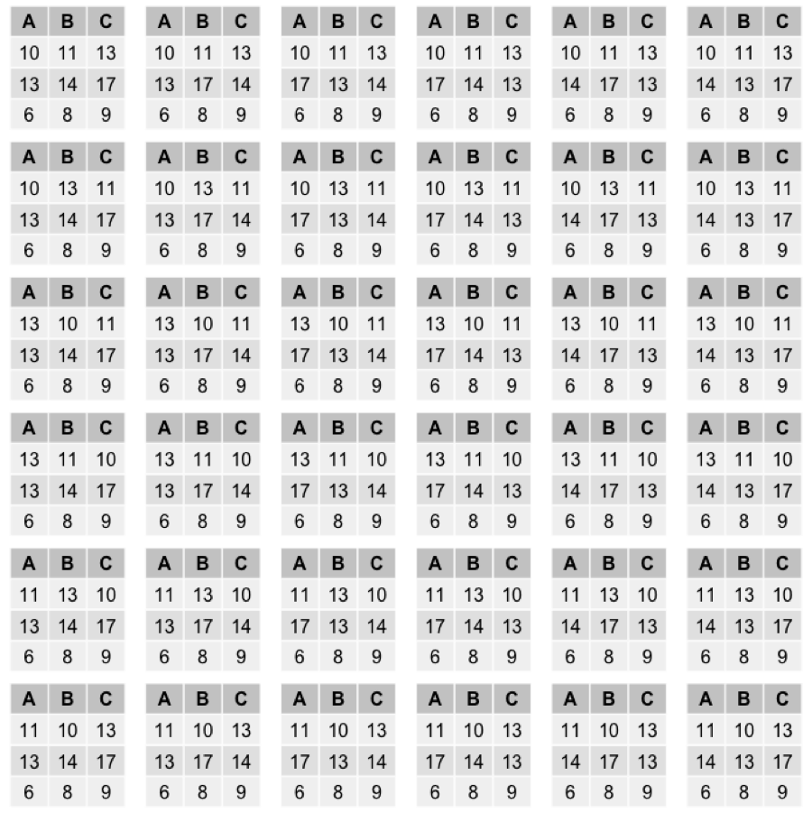

# Problem statement  
  
Consider a repeat measure experiment with 3 treatments, which we will labeled as A, B, and C. Data collected from this experiment is shown below.  
  
```{r echo = FALSE, message = FALSE}
library("knitr") #For nice tables.
library("gridExtra")
library("combinat")

data <- data.frame(Subject = c(1, 2, 3), A = c(10, 13, 6), 
                   B = c(11, 14, 8), C = c(13, 17, 9))

#data.anova <- data.frame(response <- c(10, 13, 6, 11, 14, 8, 13, 17, 9),
#                         subject <- rep(c(1, 2, 3), 3),
#                         treatment <- c(rep("A", 3), rep("B", 3), rep("C", 3)))

kable(data, caption = "Data collected from the repeat measure experiment.")

data <- as.matrix(data[, 2:4])
```
  
We are interested in whether or not there is a difference in the means of the three populations A, B, and C. That is, we want to test the hypothesis  
  
  
$$\begin{aligned}
    &H_o: \mu_A = \mu_B = \mu_C \\
    &H_a: \text{at least one of the means differs}
  \end{aligned}$$  
  
  
A randomization test will be performed, using systematic data permutations.  
  
  
# One-way ANOVA
  
In this problem, we have one treatment with three levels. The omnibus hypothesis test can be conducted using ANOVA. The test statistic is  
  
  
$$F = \frac{MSB}{MSW} = \frac{\frac{SSB}{df_{B}}}{\frac{SSW}{df_{W}}}
    = \frac{\frac{\sum_{i=1}^{k}(\bar{y}_{i\bullet} - \bar{y}_{\bullet\bullet})^2}{k-1}}{\frac{\sum_{i=1}^{k}\sum_{j=1}^{n_i}(\bar{y}_{ij} - \bar{y}_{i\bullet})^2}{N-k}}$$  
  
  
where $k = 3$ is the number of treatments, $n_i = 3$ for $i = 1, 2, 3$ is the number of observations for the $i^{th}$ treatment, $N = \sum_{i=1}^{k}n_i$ is the total number of observations, $\bar{y}_{\bullet\bullet} = \frac{1}{N}\sum_{i=1}^{k}\sum_{j=1}^{n_i}y_{ij}$ represents the grand mean, and $\bar{y}_{i\bullet} = \frac{1}{n_i}\sum_{j=1}^{n_i}y_{ij}$ is the $i^{th}$ treatment mean.  
  
  
If we assume that the observations are independent, and that the underlying populations are normally distributed and homoskedastic across the treatment groups, then under $H_o$, $F$ has an $F(df_{B},df_{W})$-distribution. However, in a repeated measures experiment we are concerned about a carry-over effect. For example, if a subject has treatment A followed by (after some period of time) treatment B, the measurement taken for treatment B may still be influenced by the earlier treatment A. If this carry-over effect does exist, then the observations will not be independent and our $F$ statistic will have some unknown distribution.
  
  
One way to deal with this carry-over effect is to instead perform a randomization test.

# Randomization test

In a randomization test, we want to consider all of the possible permutations of the data. For a repeated measures experiment, we would go through each row (each subject) and permute the columns (the treatments). For the experiment described in this problem, there are $k! = 3! = 6$ possible permutations for each row, and $n = 3$ rows, so a total of $6^{3} = 216$ possible permutations. However, it is possible to partition these permutations into $k!$ different sets, whereby each partition will produce the same set of test statistics. For the randomization test, we only need to consider one of these partitions, which will be constructed by keeping the last row of data fixed. There are $k!^{n - 1} = 3!^{2} = 36$ permutations in the partition.  
  
To calculate a $P-value$, first evaluate the test statistic, $F$, for the initial data set. Then, calculate the statistic for each of the $36$ permutations; we'll denote these by $F^{*}_{p}$. The $P-value$ is the proportion of the $F^{*}_{p}$'s that are at least as extreme as $F$.

$$P-value = \frac{\text{number of} F^{*}_{p} \geq F}{\text{number of permutations}}$$
  
## Optimizing

Consider the test statistic $F = \frac{\frac{SSB}{df_{B}}}{\frac{SSW}{df_{W}}}$. With the permutation test, we are only concerned with the inequality  
  
$$\begin{aligned}
  F^{*}_{p} &\geq F \\
  \frac{SSB^{*}_{p}}{SSW^{*}_{p}}\frac{df_{W}}{df_{B}} &\geq 
    \frac{SSB}{SSW}\frac{df_{W}}{df_{B}}
  \end{aligned}$$  
  
where $F^{*}_{p}$ is the statistic calculated on the $p^{th}$ permuted data set. We can eliminate any constant factors that appear on boths sides. Since the degrees of freedom do not change with permutations, they can be cancelled out.  
  
$$\frac{SSB^{*}_{p}}{SSW^{*}_{p}} \geq \frac{SSB}{SSW}$$
  
In addition, recall the identity $SSTO = SSB + SSW$, where $SSTO$ is the total sum of squares. This implies that, if $SSB$ increases, then $SSW$ necessarily decreases. Because of this relationship, we know $SSB$ increases if and only if $\frac{SSB}{SSW}$ increases. Since we are only interested in whether or not a permuted data set satisfies the above inequality, it is sufficient to only compute $SSB^{*}_{p}$ and compare it to $SSB$.  
  
$$SSB^{*}_{p} \geq SSB$$
  
Furthermore, by rewriting $SSB$ in its computational formula, we find more constants that can be removed.  
  
$$SSB = \sum_{i=1}^{k} \left( \frac{1}{n_i}\sum_{j=1}^{n_i}y_{ij} \right)^2 
           - \sum_{i=1}^{k} \left( \frac{1}{N}\sum_{l=1}^{k}\sum_{j=1}^{n}y_{lj} \right)^2$$
  
The second term is a constant, so it can be ignored. Also, in this experiment we have $n_i = n$ for all $i$, so the test statistic can be reduced to
  
$$F_r = \sum_{i=1}^{k} \left( \sum_{j=1}^{n}y_{ij} \right)^2$$  
  
The notation $F_r$ will be used to denote this reduced test statistic. For each permuted sample, $y^{*}_{(b)}$, we calculate $F^{*}_{r(b)} = \sum_{i=1}^{k} \left( \sum_{j=1}^{n}y^{*}_{ij} \right)^2$. These will be compared to $F_r$ computed from the original data set.
  
```{r}
F.r <- function(data) {
  sum(apply(data, 2, sum)^2)
}
```

## Obtaining systematic permutations

### Algorithm
  
It is assumed that a method for obtaining all permutations of a single vector is available; most programming languages provide functions for this procedure. In the implementation here, in R, we use the function "permn()" from the library "combinat". permn() returns a list of all permutations for a given vector.  
  
Now, to permute our original data set, a recursive function is defined. Let M denote a $n \times k$ matrix representing the original data set. The $i^{th}$ row of M will be denoted by M[i, ].
  
1.   Define "permute_matrix" with two arguments: (matrix "M" and row index "i"), as follows
2.         if i = number of rows in M
3.            PRINT M
4.         else
5.            SET perm_list = the list of all permutations of M[i, ].
6.            for each permutation in perm_list
7.               SET M[i, ] = permutation
8.               CALL permute_matrix with arguments M and i+1  
9.
10.  CALL permute_matrix with arguments M and i = 1  
  

### Code
  
```{r}
n <- nrow(data)
k <- ncol(data)
num.permutations <- (factorial(k))^(n - 1)

permute.systematic <- function(data, row.index = 1) {
  ts.list <- NULL
  if(row.index == nrow(data)) {
    return(list(data))
  }
  current.row.perms <- permn(data[row.index, ])
  for(perm in current.row.perms) {
    temp <- data
    temp[row.index, ] <- perm
    ts.list <- c(ts.list, permute.systematic(temp, row.index + 1))
  }
  return(ts.list)
}

permutation.s <- permute.systematic(data)
```

```{r eval = FALSE, echo = FALSE}
#Create a grid of tables to print out. 
#Does not work for large number of tables.
grid.arrange(grobs = lapply(permutations, tableGrob),
             ncol = 6, nrow = 6,
             widths = rep(2, 6),
             heights = rep(2, 6))
```



## Obtaining random permutations

As $n$ or $k$ become large, the total number of permutations grows exponentially, making the task of systematic permutation computationally intractable. We can instead randomly sample from this set of permutations. We then proceed as in the permutation test on this random sample gives an approximation to the actual $p-value$. 

### Algorithm

It is assumed that a method for random sampling from a vector without replacement in available. In R, we use the method "sample()". This procedure will be used to obtain a random permutation of a row in our data matrix.
  
Let M denote a $n \times k$ matrix representing the original data set. The $i^{th}$ row of M will be denoted by M[i, ]. The following algorithm prints out a random permutation of the matrix. 
  
1.   for i from 1 to n
2.        SET M[i, ] = a random permutation of M[i, ]  
3.   PRINT M  
  
  
### Code
```{r}
permute.random <- function(data, reps = 100000) {
  ts.list <- vector("list", reps)
  n <- nrow(data)
  m <- ncol(data)
  for(i in 1:reps) {
    permutation <- matrix(nrow = n, ncol = m)
    for(j in 1:(n - 1)) {
      permutation[j, ] <- sample(data[j, ], m)
    }
    permutation[n, ] <- data[n, ]
    ts.list[[i]] <- permutation
  }
  return(ts.list)
}

permutation.r <- permute.random(data)
```

# Results
  
First we compute $F_r$ for the original data.  
  
```{r}
ts <- F.r(data)
```
  
This gives $F_r = `r ts`$. Now, we calculate the test statistc for each of the permuted data sets, compare them to $F_r$, and calculate the percentage that are larger.  
  
```{r}
ts.perm <- sapply(permutation.s, F.r)
p.value.s <- sum(ts.perm >= ts)/length(ts.perm)
```
  
The $P-value$ for the permutation test is `r I(format(p.value.s, digits = 4))`. Let's now do the same procedure using the set of random permutations.  
  
```{r}
ts.perm <- sapply(permutation.r, F.r)
p.value.r <- sum(ts.perm >= ts)/length(ts.perm)
```
  
The $P-value$ for the randomization test is `r I(format(p.value.r, digits = 4))`. As discussed earlier, the randomization test is an approximation to the permutation test; the relative error of the approximation in this run was $`r I(100*(p.value.r - p.value.s)/p.value.s)`\%$. But again, since we only have $36$ possible permutations for this experiment, the systematic approach is tractable and gives us an exact answer. In either case, we observe a fairly small $P-value$ and it is reasonable to conclude that at least one of the three treatment means differs.