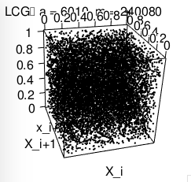

# Introduction
Consider the linear congruential generator (LCG),

$$X_{n+1} = aX_n \text{ mod } m = 7^5X_n \text{ mod } (2^{31}-1)$$  

We are interested in whether or not this is a good random number generator. A generator is "good" if it satisfies five conditions:  

1.  The numbers appear to be distributed uniformly.
2.  They are uncorrelated.
3.  There is a large period before repetition.
4.  Any sequence can be replicated.
5.  Computation is cheap.
  
Let $X = (X_1, ... X_n)$ denote a sequence of $n$ random numbers generated from our linear congruential generator. We will use the seed $X_0 = 1$ for all of the examples and statistical tests throughout this report. 

By using a LCG, conditions 4 and 5 are immediately satisfied. If we start the generator with a particular seed, we can generate the same random sequence over and over again. And compution is cheap, since only two basic operations are involved (multiplication and modulus).  
  
Condition 3 is also satisifed. Knuth (1981) shows that a linear congruential sequence, defined like ours, has a period length $m - 1$ if  

i.  $X_0$ is relatively prime to $m$
ii.  $a$ is a primitive element modulo $m$

Since $m = 2^{31} -1$ is a [Mersenne] prime, condition (i) is satisfied for all $0 < X_0 < m$. To show (ii), that $a$ is a primitive element modulo $m$, Knuth also provides sufficient conditions, namely that $a \neq 0 \text{ mod } m$ and $a^{(m-1)/q} \neq 1 \text{ mod } m$, for any prime divisor $q$ of $m-1$. The first is met since $a = 7^5$ is not a multiple of $m = 2^31-1$, and the latter can be shown using Fermat's little theorem. Since both of these critera hold for our generator, we can conlude that the period is $m-1$ (regardless of the seed that we start with).  

Now, all that remains is to check conditions (1) and (2).

# Visual Inspection
Before performing any statistical tests, let's try to get a visual look at what our generator is producing.  

### 2D plot
One quick way to determine if there's any pattern in the sequence is by graphing $X$, plotting the $n-1$ pairs $(X_i, X_{i+1}$; that is, plotting each observation against the next observation. For comparison, we will create a graph corresponding to our generator, and another for a different LCG, the second one having $a=6010$ and $m=240080$.

```{r echo = FALSE}
#Congruential generator with a = 7^5, c = 0, and m = 2^31-1.
#
Random <-  setRefClass("Random", 
                       fields = list(seed = "numeric", xn = "numeric", a = "numeric",
                                     c = "numeric", m = "numeric"),
                       methods = list(
                         initialize = function(seed, a = 16807, c = 0, m = 21474836475) {
                           xn <<- seed
                           a <<- a
                           c <<- c
                           m <<- m
                         },
                         unif = function(n = 1) {
                           vars <- numeric(n)
                           for(i in 1:n) {
                             xn <<- (a * xn + c) %% m
                             vars[i] <- xn/m
                           }
                           vars
                         }))
```

```{r} 
n <- 10000
par(mfrow=(c(1,2)))
rand <- Random(1)
data <- rand$unif(n)
plot(data[1:(n-1)], data[2:n], pch = 16, cex = 0.1, xlab = "X_i", ylab = "X_i+1", main="LCG\n a = 7^5, m = 2^31 - 1")

rand.bad <- Random(1, 6010, 0, 240080)
data.bad <- rand.bad$unif(n)
plot(data.bad[1:(n-1)], data.bad[2:n], pch = 16, cex = 0.1, xlab = "X_i", ylab = "X_i+1", main = "LCG\n a = 6010, m = 240080")
```

We can immediately identify a pattern in the graph on the right, whereas the graph produced by our generator appears no different from random noise. This is what we like to see.  

### Histogram
For another quick visual inspection, we can compare the histogram of $X$ to the pdf of a uniform distribution. And as we will see below, with $n=10000$, the distribution of the generated values and the expected distribution appears to match fairly closely. Note that, we would *not* expect these to be a perfect match; in fact, a perfect match may be cause for suspect (Suess 2010). After all, truly random data would show some variation, so we would expect to see the same from our generated numbers.

```{r} 
hist(data, freq = FALSE)
abline(h = 1, col = "red")
```

###  3D plot
So far, our generator appears to be working well. As one last visual check, we will look at a 3-dimensional plot of the points $(X_i, X_{i+1}, X_{i+2})$. As discussed by Suess and Trumbo (2010), it is important to consider dimensions higher than 2. An example is with the RANDU number generator (a multiplicative generator like ours, with $a=65539$ and $m=2^{31}$, introduced by IBM) for which a fatal flaw was discovered in the 3-dimensional space. For our generator, a plot is shown below with no obvious patterns to be found. (Note, the R code produces an interactive 3D plot - only a screenshot is shown here.)

```{r eval = FALSE}
library("rgl")
plot3d(data[1:(n-2)], data[2:(n-1)], data[3:n], pch = 16, size = 1, xlab = "X_i", ylab = "X_i+1", zlab = "x_i+2", main = "LCG\n a = 6010, m = 240080")
```

  

# Statistical Tests
Now that we have gained some confidence in our generator, let's move on to the statistical tests. 

### Kolmogorov-Smirnov Test
Recall condition (1) for a good generator, that $X$ appears to be distributed uniformly(0, 1). To test this, the Kolmogorov-Smirnov goodness-of-fit test will be used. This tests the hypothesis

$$\text{H}_0: \text{the } X_i's \text{ are i.i.d. }Unif(0, 1)$$
$$\text{H}_a: \text{the } X_i's \text{ are not i.i.d. } Unif(0, 1)$$
  
Let $F_e(x)$ denote the empirical distibution function, where

$$F_e(x) = \frac{ | \{ X_i \in X \text{ | } X_i \leq x \} | }{n},$$

which is the proportion of the generated numbers that are less than or equal to $x$. Since we are comparing these to a uniform distribution, let $F(x)=x$ denote the pdf of the uniform(0, 1). The test statistic is 

$$ t = \sup_{x} |F_e(x) - F(x)| $$

The critical value for a 0.01 significance level is $t_0 = \frac{1.6276}{\sqrt(n)}$. We now generate a sample of size $n=1000$ from our random number generator and calculate the test statistic. 

```{r}
n <- 1000
rand <- Random(1)
data <- rand$unif(n)
results <- ks.test(data, "punif") #R has a built in function for K-S test.
print(paste("t =", results$statistic, ", p-value =", results$p.value))
```

Since $t = 0.02525\leq \frac{1.6276}{\sqrt{1000}} = 0.16276$, we fail to reject $\text{H}_0$ - there is insufficient evidence to conclude that the distribution of our randomly generated numbers differs from a uniform distribution. As a visual aid, we can plot the ecdf against the pdf. Notice how the two are almost identical. The test statistic is the largest vertical distance between the two lines.

```{r}
points <- sort(data)
y <- (ecdf(points))(points)
plot(x = points, y = y, col = "red", type = "s",
      ylab = "Cumulative relative frequency", xlab = "x",
      main = paste("Empirical cdf (red) vs\n
                   Normal(0,1) pdf (black)", n))
abline(a = 0, b = 1, col = "black")
```
  
Now, it may be possible that we happened to get a "lucky" sample. So rather than test just 1 random sample, let's simulate $m = 10000$ random samples of size $n = 1000$ from the generator (this will be done in sequence without resetting the seed). The Kolmogorov-Smirnov test will be performed on each of the $m$ samples, and we will calculate the proportion of samples that pass the test. If the distribution truly does appear to be uniform, then around 99% should pass.  

```{r eval = FALSE}
m <- 10000
pass <- 0
for(i in 1:m) {
  x <- rand$unif(n) #Draw a random sample of size n.
  Sn <- ecdf(x) #Create emperical cdf function.
  #This is supx(Sn(x) - F(x)); our test statistic:
  t <- max(c(max(abs(Sn(x) - x)), max(abs(Sn(x-0.0001) - (x - 0.0001))))) 
  if(t <= crit.value) { 
    pass <- pass + 1
  }
}
```

This results in 99.81% of the samples failing to reject $\text{H}_0$, which is about what we expected. So again we fail to find any evidence that suggests our distribution is different from the uniform(0, 1). 
  
  
### Autocorrelation
Finally, we will look at condition (2) of a good random number generator; the numbers are uncorrelated. Recall, the sample correlation between two variables, say $X$ and $Y$, is defined as

\[r = \frac{\sum (X_t - \bar{X})(Y_t - \bar{Y})}{ \left[ \sum (X_t - \bar{X}) \right]^{1/2} \left[ \sum (Y_t - \bar{Y}) \right]^{1/2} }
\]

When we generate a sequence of numbers from our generator, we obtain $n$ observations of one variable - those observations being $X_1, ... X_n$. In order to use $r$ to measure linear correlation, we create a second variable by lagging this sequence of values. The second variable consists of the $n-1$ observations $X_2, ..., X_n$. Using these two variables to evaluate the correlation gives us

\[r_1 = \frac{\sum_{t=1}^{n-1}(X_t - \bar{X}_{(1)})(X_{t+1} - \bar{X}_{(2)})}{ \left[ \sum_{t=1}^{n}(X_t - \bar{X}_{(1)}) \right]^{1/2} \left[ \sum_{t=1}^{n-1}(X_{t+1} - \bar{X}_{(2)} \right]^{1/2} },
\]

where $\bar{X}_{(1)}$ and $\bar{X}_{(2)}$ are the averages of the $n-1$ random numbers, $X_1, ..., X_{n-1}$ and $X_{2}, ..., X_{n}$, respectively. We call $r_1$ the autocorrelation coefficient at lag $k = 1$. Note, if $n$ is large, the differences between $\bar{X}_{(1)}$, $\bar{X}_{(2)}$, and $\bar{X}$ are negligable. In general, we will use $r_k$ defined by
  
\[r_k = \frac{\sum_{t=1}^{n-k}(X_t - \bar{X})(X_{t+k} - \bar{X})}{ \sum_{t=1}^{n} ( X_{t} - \bar{X} )^2 }.
\]  

To decide whether the observations produced by the generator has autocorrelation, we can create a confidence interval for the $r_k$'s. Barlett showed that if the sample is generated by a uniform process, the distribution of the autocorrelation coefficients will be approximately normal with mean 0 and variance $1/n$(Levich 1999). A confidence interval for a single coefficient can be obtained by $r_k \pm  \frac{Z_{(1 - \alpha/2)}}{n^{1/2}}$. However, we likely want to consider more than just the first-order coefficient $r_k$. To obtain a set of confidence intervals for several coefficients, say $r_1, ..., r_m$, we can use the Bonferroni correction. Each confidence interval will then be $r_k \pm  \frac{Z_{(1 - \alpha/(2m))}}{n^{1/2}}$. 
  

Using the built in R function acf(), we obtain the autocorrelation coefficients with lag from 1 to 30. A graph is produce along with an approximate confidence interval. Documentation for this function does not readily show how these confidence limits are computed (Venables 2002), so we will compute the Bonferroni limits and plot those as well. Note, since the width of the confidence interval does not depend on the value of $r_i$, we can simply create an interval about 0 by $0 \pm  \frac{Z_{(1 - \alpha/(2m))}}{n^{1/2}}$; if any of the observed $r_i$'s fall outside of this bound, then we will reject $\text{H}_0$, where

$$\text{H}_0: R_1 = 0, R_2 = 0, ..., R_m = 0,$$

and $m=30$ for this example.


```{r}
plot(acf(data))
abline(h = qnorm(0.05/(2*30), 0, 1)/10, col = "red")
abline(h = -qnorm(0.05/(2*30), 0, 1)/10, col = "red")
```

None of the points in this sample fall outside of the confidence limits, so we fail to reject $\text{H}_0$.  
  
This is just one of many ways we can test for autocorrelation. Levich (1999) provides a detailed review of this method along with several others.  

# Conclusion
At this point we would like to conclude that our random number generator is good, but we must be cautious. The statistical tests considered here (and most other tests in general) can only show us when our generator is *not* good. For each test, we start off assuming that the generator has the desired properties. The tests then, can only provide us with evidence to the contrary. They can only suggest that the distribution of the generator is *not* uniform, or that autocorrelation *does* exist. 
  
Keeping this in mind, we still need to make a decision. And without significance evidence to the contrary, it is reasonable to continue to assume that our random number generator is, indeed, good.


<p style="page-break-before: always"></p>  

# References

Knuth, D. E. (1981) *The Art of Computer Programming Volume 2: Seminumerical Algorithms.* N.p.: Addison-Wesley. Print.
  
Levich, R. M., & Rizzo, R. C. (1999). Alternative Tests for Time Series Dependence Based on Autocorrelation Coefficients. WORKING PAPER SERIES-NEW YORK UNIVERSITY SALOMON CENTER S.

Ross, S. M., (2013) *Simulation*. San Diego: Academic. Print.

Suess, E. A. & Trumbo, B. E. (2010) *Introduction to Probability Simulation and Gibbs Sampling with R.* New York: Springer. Print.

Venables, W. N, & Ripley, B. D. (2002) *Modern Applied Statistics with S*. N.P.: Springer. Print.

